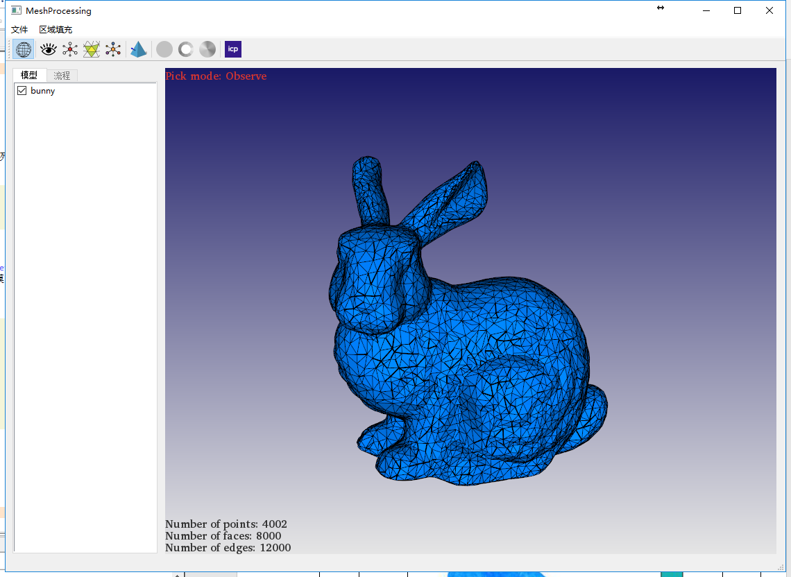
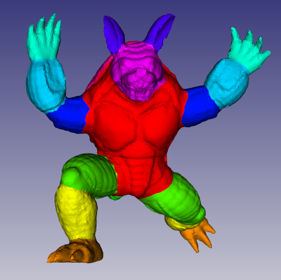
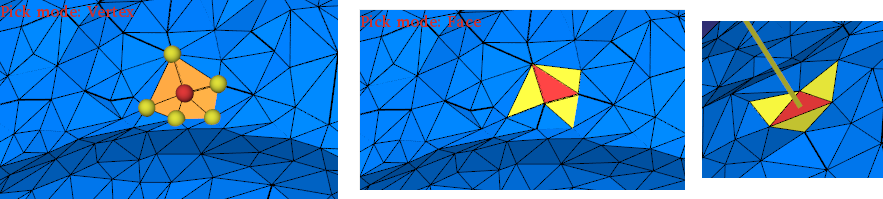
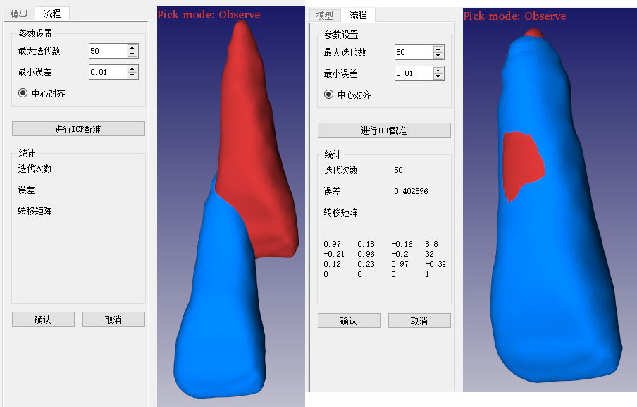

# MeshViewer
---

## Features
+ Read 3d mesh data including *.obj, *.stl, *.off
+ Highlight single vertex & multiple vertices & single face & face normal by clicking surface of a mesh
+ Display mesh data with/without wireframe
+ Display number of points & faces & edges
+ Implementation of ICP algorithm & semi-automatic segmentation algorithm

## Examples

UI overview

Display color table

Selection modes

ICP algorithm

try
try 2
